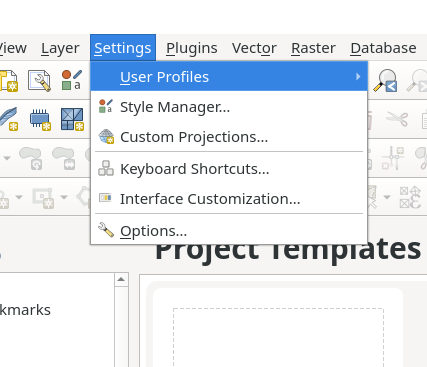
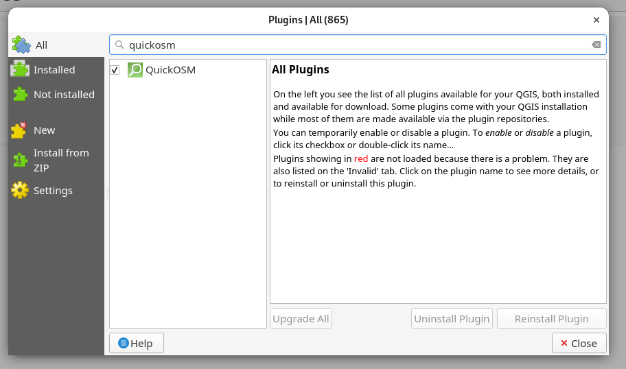

# OpenPopulationEstimator

This tool can be used to estimate the inhabitant count per house in an area with a known population.
The result is based on a very simple heuristic, so low accuracy should be expected.


## Setup

### Step 1: Install Qgis:


**Arch** based:
```
$ sudo pacman -S qgis
```

**Debian** based:

check [Qgis Website](https://www.qgis.org/de/site/forusers/alldownloads.html) for updated instructions.
```
$ sudo apt install gnupg software-properties-common

$ wget -qO - https://qgis.org/downloads/qgis-2021.gpg.key | sudo gpg --no-default-keyring --keyring gnupg-ring:/etc/apt/trusted.gpg.d/qgis-archive.gpg --import

$ sudo chmod a+r /etc/apt/trusted.gpg.d/qgis-archive.gpg

$ sudo add-apt-repository "deb https://qgis.org/ubuntu $(lsb_release -c -s) main"

$ sudo apt update

$ sudo apt install qgis qgis-plugin-grass
```

For use under **Windows / MacOS** install Qgis using the default installer from the official website: [www.qgis.org](https://www.qgis.org/en/site/)
And check step 3 "Change Plugin Folder" after finishing the setup.
### Step 2: Open Qgis + Install QuickOSM plugin

Please check that the default Profile is selected!
If you want to use a different Profile check step 3 "Change Plugin Folder".



Under **Plugins > Manage and Install Plugins...** search for QuickOSM in the "All" tap.



Finally install the plugin. (:

### (optional) Step 3: Change Plugin Folder

If you are using a different installation folder / operating system for your Qgis setup please check the **main.py** file and change the plugin directories accordingly starting in **line 20**. 


## Execution

To execute the CLI run:

```
cd src
python main.py
```

Output:
A Geopackage with all buildings including the additional field 'pop'
